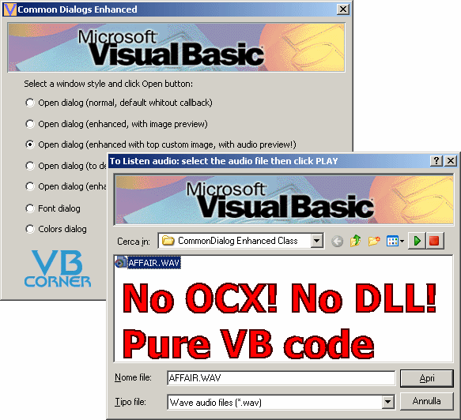



## CommonDialog Enhanced Callback

### Description

CD Enhanced is a sample VB project that show how to use the system CommonDialog without OCX/DLL.

Moreover, show how to use CommonDialog 'callback' to enhanced your dialogs and manage advanced features never see like: images preview (with stretch or not), audio wav/midi preview (play directly in CommonDialog!), you can add custom image where you want, resize common dialog to add your controls (TextBox, Toolbar, PictureBox, ecc. and manage them events).

Example you can add a TextBox in the system Font dialog that display a custom text.

With this CD class you can transform a system CommonDialog how you desire!!!

The image below shows the Audio-Preview dialog with a top custom image.
 
### More Info
 

             |
---                |---
**Submitted On**   |2004-07-11 10:01:22
**By**             |[gibra](https://github.com/Planet-Source-Code/PSCIndex/blob/master/ByAuthor/gibra.md)
**Level**          |Advanced
**User Rating**    |4.9 (176 globes from 36 users)
**Compatibility**  |VB 6\.0
**Category**       |[Custom Controls/ Forms/  Menus](https://github.com/Planet-Source-Code/PSCIndex/blob/master/ByCategory/custom-controls-forms-menus__1-4.md)
**World**          |[Visual Basic](https://github.com/Planet-Source-Code/PSCIndex/blob/master/ByWorld/visual-basic.md)
**Archive File**   |[CommonDial196237142006\.zip](https://github.com/Planet-Source-Code/gibra-commondialog-enhanced-callback__1-63920/archive/master.zip)

